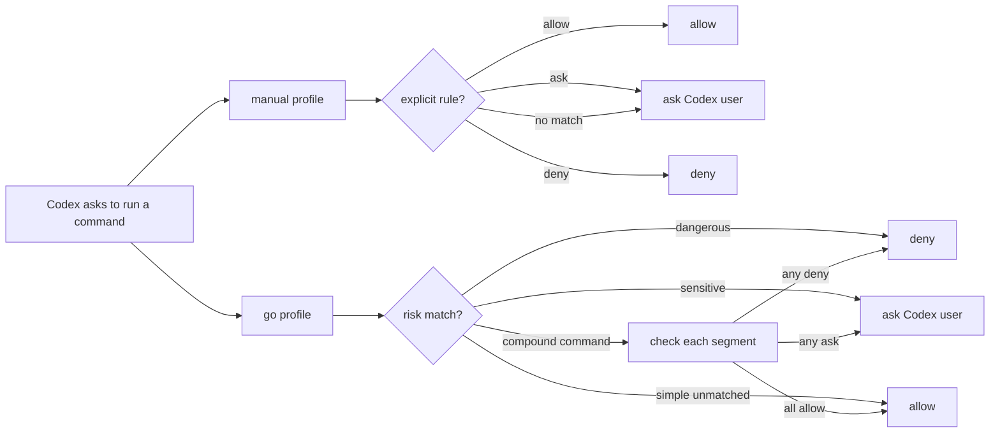

# CodexGo

CodexGo is a small policy layer for Codex `PermissionRequest` hooks. It lets Codex auto-approve low-risk shell approvals, deny known-dangerous patterns, and fall back to the normal Codex prompt when no rule matches.

[Changelog](CHANGELOG.md) | Current stable release: `v0.1.3`

## Quick Start

Install CodexGo on macOS:

```sh
curl -fsSL https://raw.githubusercontent.com/fengzdadi/codexgo/main/install.sh | sh
```

Verify the install:

```sh
codexgo version
codexgo explain "git status"
```

Install the hook for your Codex user config:

```sh
codexgo init --scope user
```

Start a new Codex session after running `init` so Codex reloads hooks.

## Smooth Mode

If you want Codex to work with fewer permission interruptions, enable the `go` profile for your workspace:

```sh
codexgo go --scope project
```

In `go` profile, CodexGo allows most simple development commands, still asks for sensitive commands such as `git push`, and denies dangerous commands such as `rm -rf /`.

For compound commands such as `cmd1 && cmd2` or `cmd1 | cmd2`, CodexGo checks each segment. If any segment asks or denies, the whole command asks or denies; if every segment is allowed, the whole command is allowed. Commands that write files through redirection or downloads still ask.

Return to manual mode with:

```sh
codexgo manual --scope project
```

Profile behavior at a glance:



## Common Commands

Add explicit rules:

```sh
codexgo allow --scope project "git add"
codexgo ask --scope project "git push"
codexgo deny --scope user "git reset --hard"
codexgo remove --scope project "git push"
```

Inspect decisions:

```sh
codexgo profile
codexgo explain "git commit -m test"
codexgo list
codexgo suggest
```

`suggest` reads recent audit logs and recommends explicit rules for repeated prompts. It only prints suggested commands; it does not change policy files.

## How It Works

Codex App can ask for approval many times during ordinary development. CodexGo installs a hook handler before the approval prompt:

```text
Codex PermissionRequest -> codexgo decide -> allow / deny / no decision
```

No decision means Codex keeps its normal approval dialog.

CodexGo only handles Codex `PermissionRequest` hooks. It does not disable operating system permissions, Git protections, network authentication, or any separate sandbox layer outside Codex hooks.

## Docs

- [Install](docs/install.md)
- [Policy and profiles](docs/policy.md)
- [Project setup](docs/project-setup.md)
- [Troubleshooting](docs/troubleshooting.md)

## Minimal Project Example

```sh
codexgo init --scope project
codexgo go --scope project
codexgo explain "npm install react"
codexgo explain "git push"
codexgo explain "rm -rf /"
```

Example outcomes:

```text
npm install react -> allow
git push          -> ask
rm -rf /          -> deny
```
