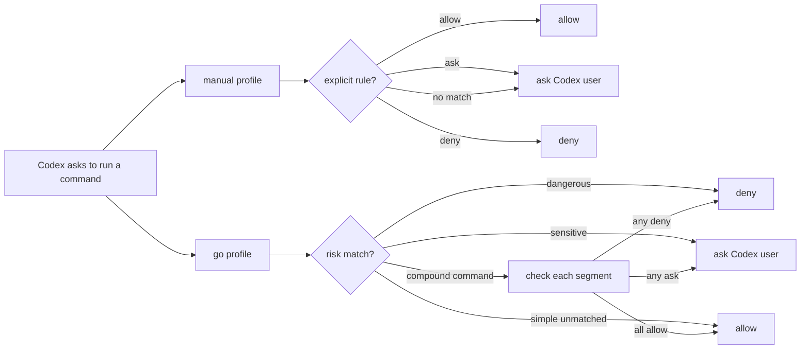

# Policy And Profiles

Most users should add rules with the CLI:

```sh
codexgo allow "git status"
codexgo allow --scope project "npm run lint"
codexgo deny --scope user "git reset --hard"
codexgo ask --match exact "npm install lodash"
codexgo go --scope project
codexgo manual --scope project
codexgo remove --scope project "git push"
```

By default these commands use `--scope user`, `--tool Bash`, and `--match prefix`.

User policy lives at:

```text
~/.codexgo/policy.json
```

Project policy lives at:

```text
<repo>/.codexgo/policy.json
```

CodexGo resolves policy from most specific to least specific:

```text
project policy > user policy > built-in defaults
```

When the `go` profile is enabled, CodexGo inserts the profile risk rules before built-in defaults and uses a final fallback allow for simple unmatched commands:

```text
project policy > user policy > go profile risk rules > built-in defaults > go fallback allow
```

Within one policy source, stricter decisions win:

```text
deny > ask > allow
```

Project rules are meant to override user-wide preferences for a specific repository. Built-in defaults are not copied into policy files, so local policy only stores rules you explicitly add.

Built-in defaults currently auto-allow read-only discovery commands such as `pwd`, `ls`, `rg`, `git status`, `git diff`, `git log`, and common local verification commands such as `go test`, `npm test`, and `pytest`. Destructive patterns such as `git reset --hard` and remote shell execution patterns such as `curl | sh` are denied.

## Profiles

CodexGo has two practical modes:

- Manual mode: the default. Unmatched commands return to the normal Codex prompt.
- `go` profile: unmatched simple commands are allowed, dangerous commands are denied, and sensitive commands still ask.

Enable the `go` profile with:

```sh
codexgo go --scope project
```

Return to manual mode with:

```sh
codexgo manual --scope project
```

`codexgo go` writes `"profile": "go"` to the selected policy file. `codexgo manual` removes the profile field from that policy file. The risk list stays built into CodexGo, so upgrading CodexGo can improve the profile without copying large starter rules into every project.

The `go` profile currently denies dangerous commands such as `rm -rf /`, `rm -rf ~`, `sudo rm`, `chmod -R 777 /`, `chown -R`, `dd if=`, `mkfs`, `diskutil erase`, `git reset --hard`, `git clean -fdx`, and forced pushes. It asks for destructive local commands such as `rm -rf` and `find . -delete`, plus sensitive commands such as `git push`, `git rebase`, `git commit --amend`, `npm publish`, `gh release delete`, `docker system prune`, and `brew uninstall`.

For compound commands such as `cmd1 && cmd2` or `cmd1 | cmd2`, CodexGo checks each segment. If any segment asks or denies, the whole command asks or denies; if every segment is allowed, the whole command is allowed. Remote shell execution such as `curl ... | sh` is denied.

The `go` profile asks instead of allowing when a command writes through redirection, downloads directly to a file with `curl` or `wget`, uses a complex environment assignment such as `TOKEN=$(...)`, includes command substitution or wildcards, or runs in a subshell such as `(cd app && npm test)`.

Environment-variable prefixes are evaluated by the underlying command, so `NODE_ENV=test npm test` is treated like `npm test`. Quoted operators do not count as shell control syntax, so `echo "a | b"` stays a simple command.

Profile behavior at a glance:



## Policy JSON

A policy looks like:

```json
{
  "defaultDecision": "ask",
  "profile": "go",
  "rules": [
    {
      "name": "codexgo allow prefix Bash commands",
      "decision": "allow",
      "tools": ["Bash"],
      "match": "prefix",
      "commands": ["git add", "git commit"]
    }
  ]
}
```

Rule decisions:

- `allow`: CodexGo approves the request and Codex does not show the prompt.
- `deny`: CodexGo blocks the request.
- `ask`: CodexGo declines to decide, so Codex shows the normal prompt.

Use `remove` when you want to delete a local rule entirely. Use `ask` when you want to keep an explicit rule that forces CodexGo to hand the command back to Codex for normal prompting.

Rule match modes:

- `exact`: command must match exactly after whitespace normalization.
- `prefix`: command must equal the pattern or start with `pattern + space`.
- `contains`: command must contain the pattern.

The CLI writes ordinary policy JSON, so you can still edit the file by hand for bulk changes. An empty policy is valid:

```json
{
  "defaultDecision": "ask",
  "rules": []
}
```

## Inspect Decisions

Use `explain` to see why a command would be allowed, denied, or sent back to the Codex prompt:

```sh
codexgo explain "git status --short"
codexgo explain "git commit -m test"
codexgo explain "npm install react"
```

Example:

```text
Command: git commit -m test
Tool: Bash
Decision: allow
Source: project policy
Rule: codexgo allow prefix Bash commands
Match: prefix
Pattern: git commit
Reason: matched project policy rule "codexgo allow prefix Bash commands"
```

Use `list` to view the effective policy stack:

```sh
codexgo list
```
